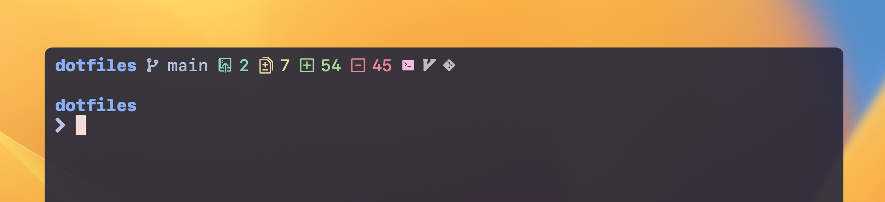
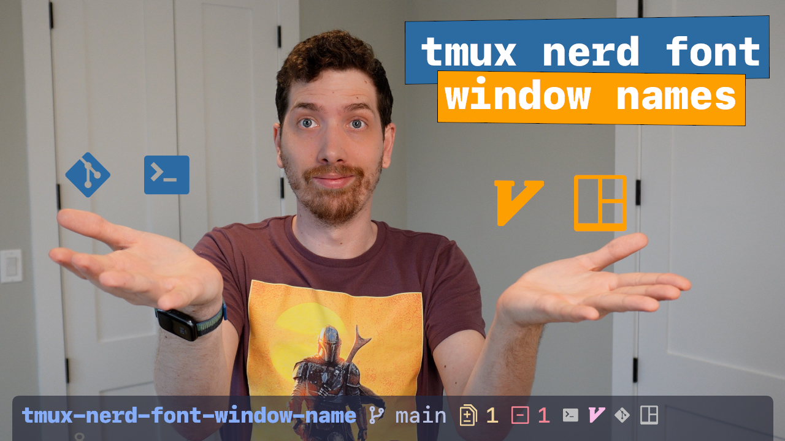

# tmux nerd font window name plugin

Automatically add Nerd Font support to your tmux window names!



## Requirements

The following dependencies are required in order to use this plugin:

- [tmux](https://github.com/tmux/tmux)
- [tpm](https://github.com/tmux-plugins/tpm)

## Installation (via tpm)

Add the following line to your tmux configuration file:

```sh
set -g @plugin 'joshmedeski/tmux-nerd-font-window-name'
```

Run `<prefix>+I` to trigger the tpm installer which will download
and source the plugin.

## Configuration

You can configure this plugin by creating a `~/.config/tmux/tmux-nerd-font-window-name.yml`
file. The following options can be changed:

```yml
config:
  fallback-icon: "?" # show when no definition is found
  multi-pane-icon: "" # show when window has multiple panes (blank by default)
  show-name: true # show the window name with the icon (defaults to false)
  always-show-fallback-name: false # always show the name alongside the fallback icon, even when show-name is false (defaults to false)
  icon-position: "left" # show the icon to the "left" or "right" of the window name (defaults to left)

icons:
  zsh: "" # overwrite with your own symbol (Nerd Font icon, emoji, whatever!)
  cmatrix: "🤯" # add new entries that aren't included
```

### Custom Placeholder Support

If you prefer to define your own `automatic-rename-format`,
you can include a placeholder that lets this plugin inject its icon output.

For example:

```tmux
set -g automatic-rename-format "#{window_icon} #{b:pane_current_path}"
```

## Contributing

Contributions are welcome! See [CONTRIBUTING.md](CONTRIBUTING.md) for guidelines on adding icons, running tests, and submitting pull requests.

## Intro Video

Here is the introduction blog post and video that I made for this plugin:

[](https://www.joshmedeski.com/posts/tmux-nerd-font-window-name-plugin/)

## Additional tmux plugins

I've authored a few other tmux plugins that you might find useful:

- [sesh - tmux session manager](https://github.com/joshmedeski/sesh)
- [tmux-fzf-url - Quickly open urls with fzf](https://github.com/joshmedeski/tmux-fzf-url)
